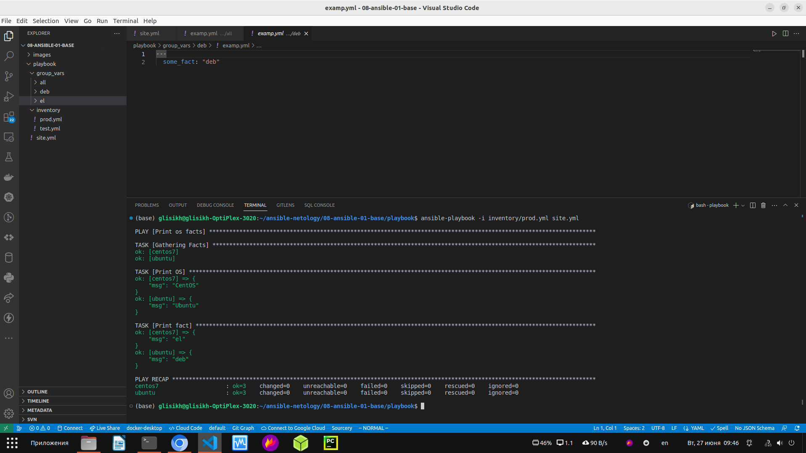

1. Попробуйте запустить playbook на окружении из test.yml, зафиксируйте значение, которое имеет факт some_fact для указанного хоста при выполнении playbook.

Ответ в виде скриншота:

  

2. Найдите файл с переменными (group_vars), в котором задаётся найденное в первом пункте значение, и поменяйте его на all default fact.

Ответ в виде скриншота:

  

3. Воспользуйтесь подготовленным (используется docker) или создайте собственное окружение для проведения дальнейших испытаний.

Ответ в виде скриншота:

  

4. Проведите запуск playbook на окружении из prod.yml. Зафиксируйте полученные значения some_fact для каждого из managed host.

Ответ в виде скриншота:

  

5. Добавьте факты в group_vars каждой из групп хостов так, чтобы для some_fact получились значения: для deb — deb default fact, для el — el default fact.

Ответ в виде скриншотов:

  

  

6. Повторите запуск playbook на окружении prod.yml. Убедитесь, что выдаются корректные значения для всех хостов.

Ответ в виде скриншота:

  

7. При помощи ansible-vault зашифруйте факты в group_vars/deb и group_vars/el с паролем netology.

Ответ в виде скриншота:

  

8. Запустите playbook на окружении prod.yml. При запуске ansible должен запросить у вас пароль. Убедитесь в работоспособности.

Ответ в виде скриншота:

  

9. Посмотрите при помощи ansible-doc список плагинов для подключения. Выберите подходящий для работы на control node.

Ответ в виде скриншота:

  

Я выбрал плагин local

10. В prod.yml добавьте новую группу хостов с именем local, в ней разместите localhost с необходимым типом подключения.

Ответ в виде скриншотов:

  

  

11. Запустите playbook на окружении prod.yml. При запуске ansible должен запросить у вас пароль. Убедитесь, что факты some_fact для каждого из хостов определены из верных group_vars.

Ответ в виде скриншота:

  

