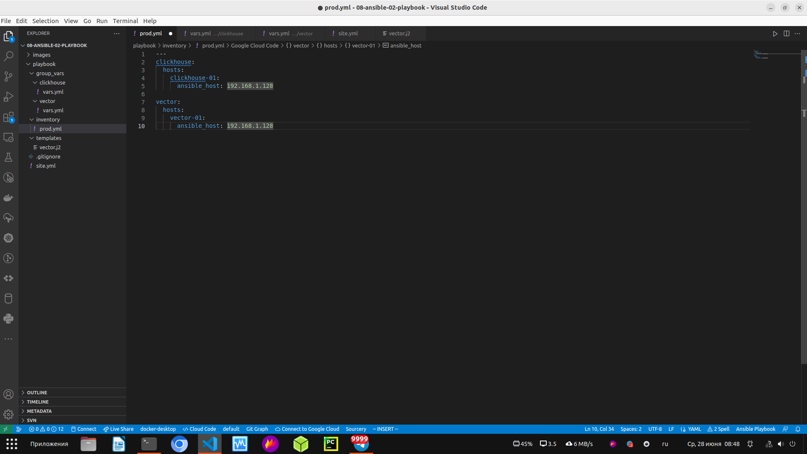

1. Подготовьте свой inventory-файл prod.yml

Я подготовил свой inventory-файл prod.yml: [prod.yaml](https://github.com/george25031996/ansible-netology/blob/main/08-ansible-02-playbook/playbook/inventory/prod.yml)
Здесь я прописал свой ip-адресс для установки и настройки clickhouse и вектор.
Также прикладываю скриншот о проделанной работе:

  

2. Допишите playbook: нужно сделать ещё один play, который устанавливает и настраивает vector.

Ссылка на playbook с добавленным play для установки и настройки vector: [playbook c vector](https://github.com/george25031996/ansible-netology/blob/main/08-ansible-02-playbook/playbook/site.yml)
Сначала прописал task для установки Vector: с какого сайта скачать vector и какой версии, на какой hosts скачать
В следующем task происходит установка скачанной версии vector на hosts повышенными привилегиями (become)
В следующем task происходит настройка Vector c повышенными привилегиями (become): src - из шаблона (templates), который называется vector.j2 
(ссылка: [vector.j2](https://github.com/george25031996/ansible-netology/blob/main/08-ansible-02-playbook/playbook/templates/vector.j2). 
В шаблоне vector.j2 vector_config - это переменнная в group_vars 
в папке vector - файл: [vars.yaml](https://github.com/george25031996/ansible-netology/blob/main/08-ansible-02-playbook/playbook/group_vars/vector/vars.yml)), 
ansible берёт его параметры и на hosts создаёт файл /etc/vector/config.yaml (изначально делал файл /etc/vector/vector.toml, но с ним vector не захотел работать)

Скрин проделанной работы:

  

 

3. При создании tasks рекомендую использовать модули: get_url, template, unarchive, file.

4. Tasks должны: скачать дистрибутив нужной версии, выполнить распаковку в выбранную директорию, установить vector.

5. Запустите ansible-lint site.yml и исправьте ошибки, если они есть.

Сделал ansible-lint site.yml исправил ошибки, потому что текст в коде стоял не правильно.

Скрин о проделанной работе:

  

6. Попробуйте запустить playbook на этом окружении с флагом --check.

Я ввёл команду ansible-playbook site.yml -i inventory/prod.yml --check --ask-become-pass и ввёл пароль.

Скрин о проделанной работе:

  

  

Он завершился с 1 ошибкой т.к. нет скаченных артефактов по которым он мог бы выполнить проверку сценария.

7. Запустите playbook на prod.yml окружении с флагом --diff. Убедитесь, что изменения на системе произведены.

Я ввёл команду команду ansible-playbook site.yml -i inventory.yml --diff --ask-become-pass и ввёл пароль.

Ansible произвёл скачивание, установку и настройку clickhouse и vector, 
а также взял данные из переменной vector_config в шаблоне vector.j2 и создал файл /etc/config.yml

Скрины о проделанной работе:

  

  

Убедился, что изменения на системе произведены:

  

8. Повторно запустите playbook с флагом --diff и убедитесь, что playbook идемпотентен.

Повторно ввёл команду команду ansible-playbook site.yml -i inventory.yml --diff --ask-become-pass и ввёл пароль.

Скрин проделанной работы:

  

P.S. Также проверил, что vector исправно работает:

  

