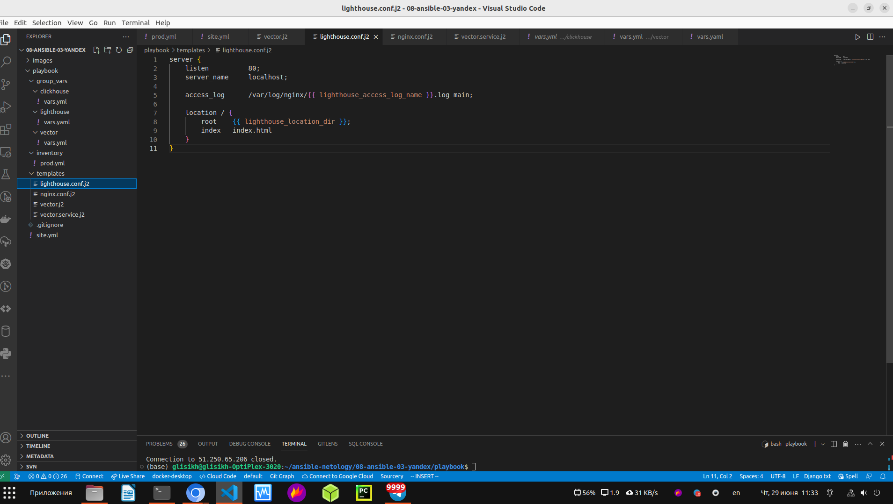
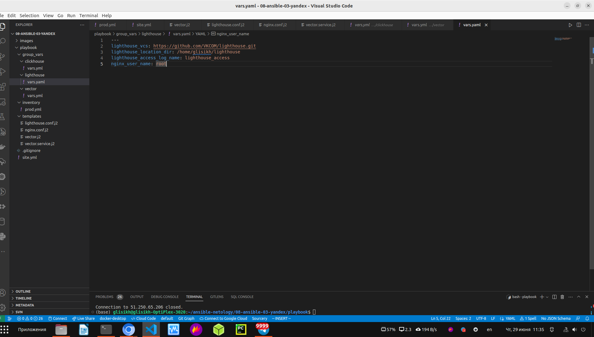

Подготовка к выполнению:

1. Подготовьте в Yandex Cloud три хоста: для clickhouse, для vector и для lighthouse.

Я подготовил 3 ВМ в своём yandex cloud и сделал скрины поздно, когда уже удалял эти ВМ по окончанию задания.

Скрин проделанной работы:

  

Основная часть:

1. Допишите playbook: нужно сделать ещё один play, который устанавливает и настраивает LightHouse.

Ссылка на playbook с добавленным play для установки и настройки LightHouse + Nginx (Так как lighthouse требует установку любого веб-сервера): 
[playbook c LightHouse + Nginx](https://github.com/george25031996/ansible-netology/blob/main/08-ansible-03-yandex/playbook/site.yml)

Написал кода для установки и настройки Nginx:
1) Сначала прописал task для установки epel-release на hosts lighthouse c повышенными привилегиями (become).
2) В следующем task происходит установка Nginx через yum на hosts lighthouse повышенными привилегиями (become)
3) В следующем task происходит настройка Nginx c повышенными привилегиями (become): src - из шаблона (templates), который называется nginx.conf.j2 
(ссылка: [nginx.conf.j2](https://github.com/george25031996/ansible-netology/blob/main/08-ansible-03-yandex/playbook/templates/nginx.conf.j2).
Также прописал в task запуск после настройки: notify: start-nginx.
3) В шаблоне nginx.conf.j2 nginx_user_name, lighthouse_location_dir - это переменные в group_vars/lighthouse/vars.yaml 

Потом я пишу код для установки и настройки lighthouse:
1) Сначала прописал task для установки git, с помощью которого в дальнейшем будет скачан lighthouse.
2) В следующем task происходит скачка lightouse.
lighthouse_vcs, lighthouse_location_dir - это переменные в group_vars/lighthouse/vars.yaml
3) В следующем task происходит настройка lighthouse c повышенными привилегиями (become): src - из шаблона (templates), который называется lighthouse.conf.j2
(ссылка: [lighthouse.conf.j2](https://github.com/george25031996/ansible-netology/blob/main/08-ansible-03-yandex/playbook/templates/lighthouse.conf.j2).
Этот шаблон кладётся в Nginx для дальнейшей работы lighthouse. 
Также прописал в task прописал перезапуск Nginx после настройки, чтобы все настройки применились успешно: notify: reload-nginx.

Скрин проделанной работы:

  

 

  

 

  

  

  

2. При создании tasks рекомендую использовать модули: get_url, template, yum, apt.

3. Tasks должны: скачать статику LightHouse, установить Nginx или любой другой веб-сервер, настроить его конфиг для открытия LightHouse, запустить веб-сервер.

4. Подготовьте свой inventory-файл prod.yml.

Я подготовил свой inventory-файл prod.yml: [prod.yml](https://github.com/george25031996/ansible-netology/blob/main/08-ansible-03-yandex/playbook/inventory/prod.yml)

Здесь я прописал внешние ip-адресса виртуальных машин в YandexCloud для установки и настройки clickhouse, vector, lighthouse с входом на виртуальные машины с помощью пользователя glisikh.

Также прикладываю скриншот о проделанной работе:

  

5. Запустите ansible-lint site.yml и исправьте ошибки, если они есть.

Сделал ansible-lint site.yml исправил ошибки, потому что текст в коде стоял не правильно.

Скрин о проделанной работе:

  

6. Попробуйте запустить playbook на этом окружении с флагом --check.

Я ввёл команду ansible-playbook site.yml -i inventory/prod.yml 

Скрин о проделанной работе:

  

Он завершился с 1 ошибкой т.к. нет скаченных артефактов по которым он мог бы выполнить проверку сценария.

7. Запустите playbook на prod.yml окружении с флагом --diff. Убедитесь, что изменения на системе произведены.

Я ввёл команду команду ansible-playbook site.yml -i inventory/prod.yml --diff

Ansible произвёл скачивание, установку и настройку clickhouse, vector, Nginx и lighthouse.
Взял шаблоны (nginx.conf.j2 и lighthouse.conf.j2) и создал файлы на hosts lighthouse (/etc/nginx/nginx.conf и /etc/nginx/conf.d/default.conf)

Скрины о проделанной работе:

  

  

  

  

  

  

  

Убедился, что изменения на системе произведены:

  

  

8. Повторно запустите playbook с флагом --diff и убедитесь, что playbook идемпотентен.

Повторно ввёл команду команду ansible-playbook site.yml -i inventory/prod.yml --diff

Скрин проделанной работы:

  

  

