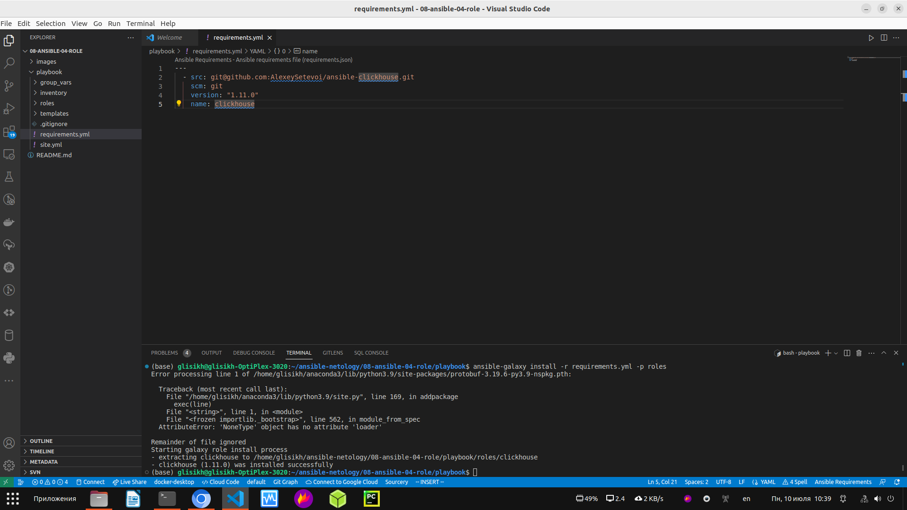
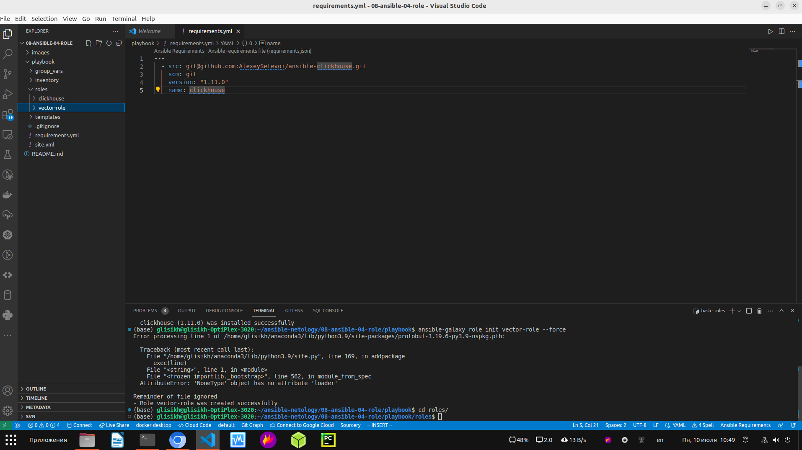
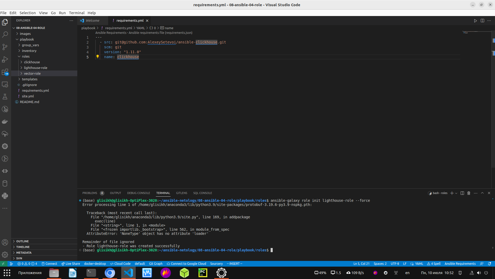
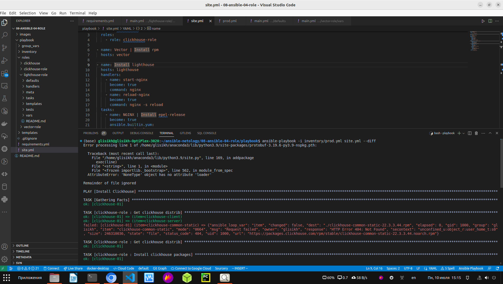
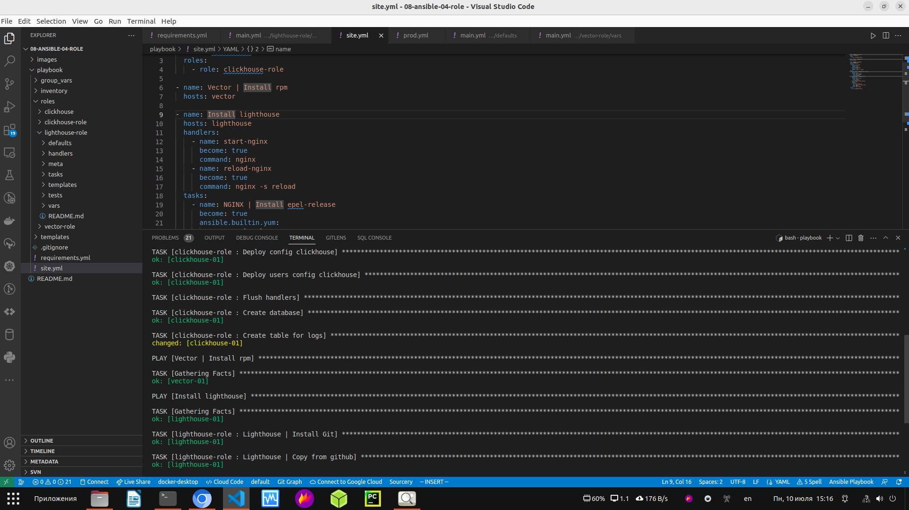
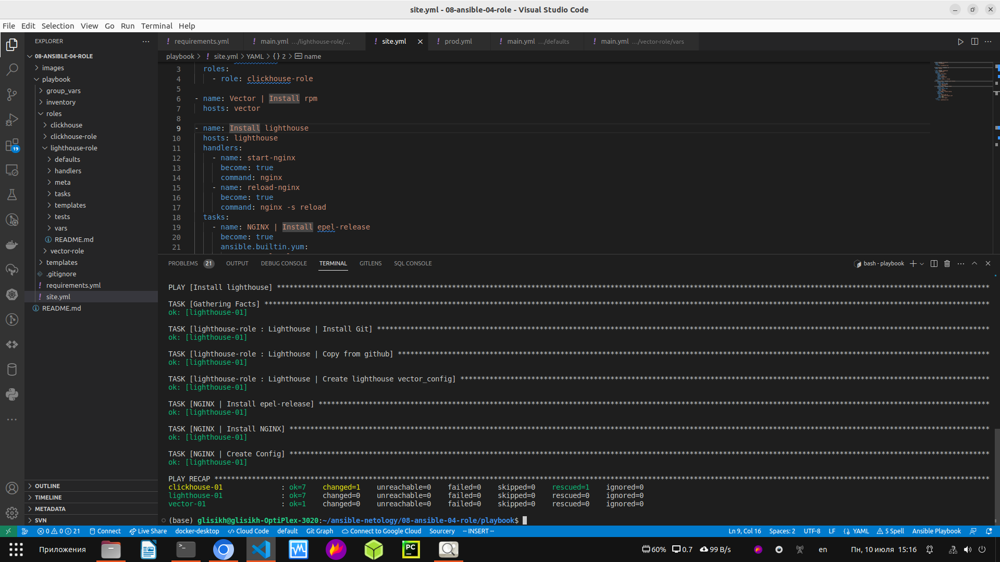

Домашнее задание к занятию 4 «Работа с roles»

Основная часть

Что нужно сделать

1. Создайте в старой версии playbook файл requirements.yml и заполните его содержимым:

Создал файл requiremenst.yml и заполнил его содержимым.

Скриншот выполненной работы:

  

2. При помощи ansible-galaxy скачайте себе эту роль.

Скачал эту роль с помощью ansible-galaxy.

Скриншот выполненной работы:

  

3. Создайте новый каталог с ролью при помощи ansible-galaxy role init vector-role.

Создал новый каталог с ролью при помощи ansible-galaxy role init vector-role.

Скриншот выполненной работы:

  

4. На основе tasks из старого playbook заполните новую role. Разнесите переменные между vars и default.

Новая роль с разнесёнными переменными в vars и default:

[Переменные vars в vector-role](https://github.com/george25031996/ansible-netology/blob/main/08-ansible-04-role/playbook/roles/vector-role/vars/main.yml)

[Переменные defaults в vector-role](https://github.com/george25031996/ansible-netology/blob/main/08-ansible-04-role/playbook/roles/vector-role/defaults/main.yml)

[vector-role](https://github.com/george25031996/ansible-netology/tree/main/08-ansible-04-role/playbook/roles/vector-role)

5. Перенести нужные шаблоны конфигов в templates.

Перенёс нужные шаблоны конфигов в templates.

[Шаблоны конфигов templates в vector-role](https://github.com/george25031996/ansible-netology/tree/main/08-ansible-04-role/playbook/roles/vector-role/templates)

6. Опишите в README.md обе роли и их параметры.

Сделал ещё одну роль с ClickHouse. Разнёс переменные между vars и default. Также перенёс нужные шаблоны конфигов в templates.

[Переменные vars в clickhouse-role](https://github.com/george25031996/ansible-netology/blob/main/08-ansible-04-role/playbook/roles/clickhouse-role/vars/main.yml)

[Переменные defaults в clickhouse-role](https://github.com/george25031996/ansible-netology/blob/main/08-ansible-04-role/playbook/roles/clickhouse-role/defaults/main.yml)

[Шаблоны конфигов templates в clickhouse-role](https://github.com/george25031996/ansible-netology/tree/main/08-ansible-04-role/playbook/roles/clickhouse-role/templates)

[clickhouse-role](https://github.com/george25031996/ansible-netology/tree/main/08-ansible-04-role/playbook/roles/clickhouse-role)

7. Повторите шаги 3–6 для LightHouse. Помните, что одна роль должна настраивать один продукт.

Повторил шаги 3-6 для LightHouse.

[Переменные vars в lighthouse-role](https://github.com/george25031996/ansible-netology/tree/main/08-ansible-04-role/playbook/roles/lighthouse-role/vars/main.yml)

[Переменные defaults в lighthouse-role](https://github.com/george25031996/ansible-netology/blob/main/08-ansible-04-role/playbook/roles/lighthouse-role/defaults/main.yml)

[Шаблоны конфигов templates в lighthouse-role](https://github.com/george25031996/ansible-netology/tree/main/08-ansible-04-role/playbook/roles/lighthouse-role/templates)

[lighthouse-role](https://github.com/george25031996/ansible-netology/tree/main/08-ansible-04-role/playbook/roles/lighthouse-role)

Скриншот выполненной задачи:

  

8. Выложите все roles в репозитории. Проставьте теги, используя семантическую нумерацию. Добавьте roles в requirements.yml в playbook.

Выложил все roles в репозитории:

[vector-role](https://github.com/george25031996/vector-role)

[clickhouse-role](https://github.com/george25031996/clickhouse-role)

[lighthouse-role](https://github.com/george25031996/lighthouse-role)

 Добавил roles в requirements.yml в playbook:

  

9. Переработайте playbook на использование roles. Не забудьте про зависимости LightHouse и возможности совмещения roles с tasks.

Переработал playbook на использование roles:

[playbook](https://github.com/george25031996/ansible-netology/blob/main/08-ansible-04-role/playbook/site.yml)

10. Выложите playbook в репозиторий.

Выложите playbook в репозиторий.

11. В ответе дайте ссылки на оба репозитория с roles и одну ссылку на репозиторий с playbook.

[vector-role](https://github.com/george25031996/vector-role)

[clickhouse-role](https://github.com/george25031996/clickhouse-role)

[lighthouse-role](https://github.com/george25031996/lighthouse-role)

[playbook](https://github.com/george25031996/ansible-netology/blob/main/08-ansible-04-role/playbook/site.yml)

P.S. Скрины того, что playbook рабочий:

  

  

  

