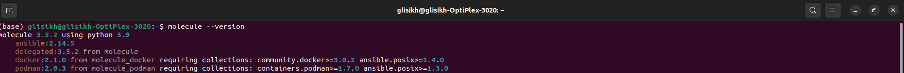
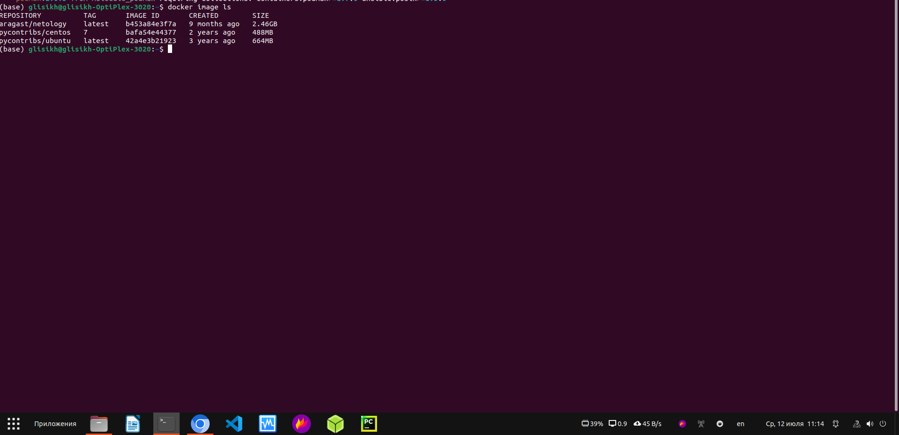
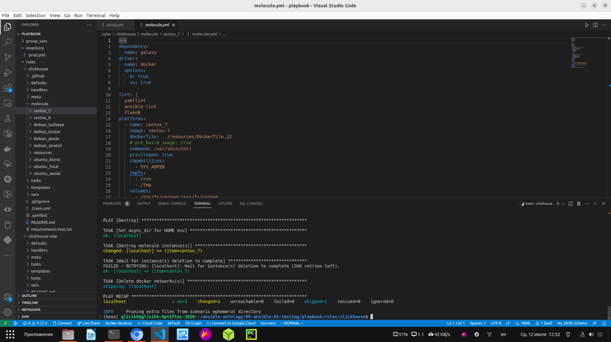
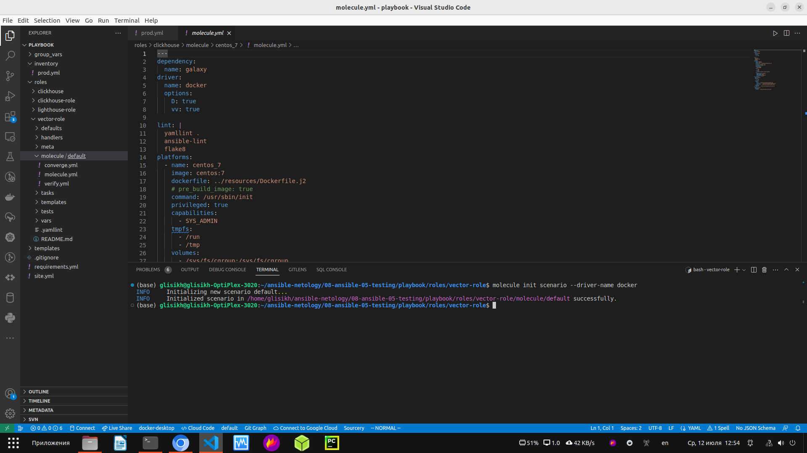
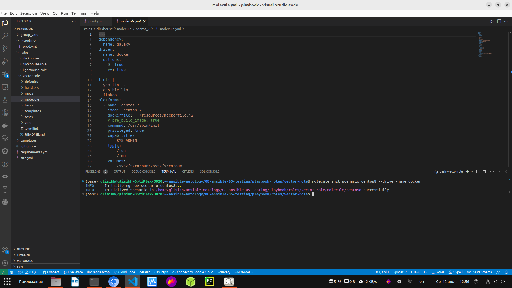
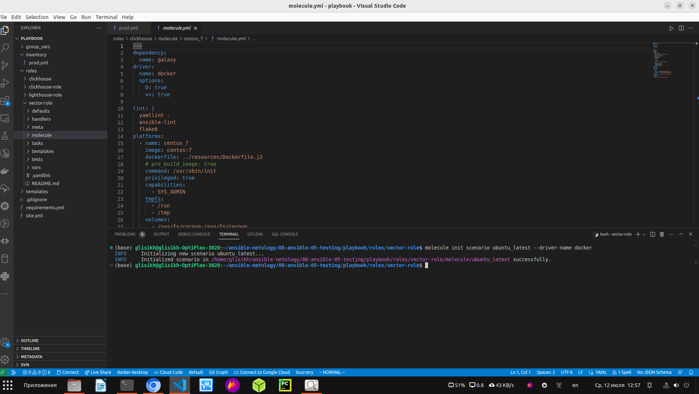
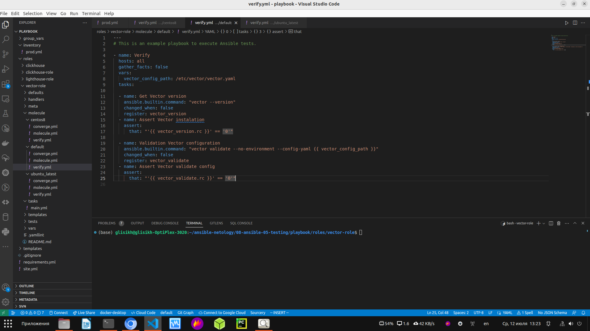
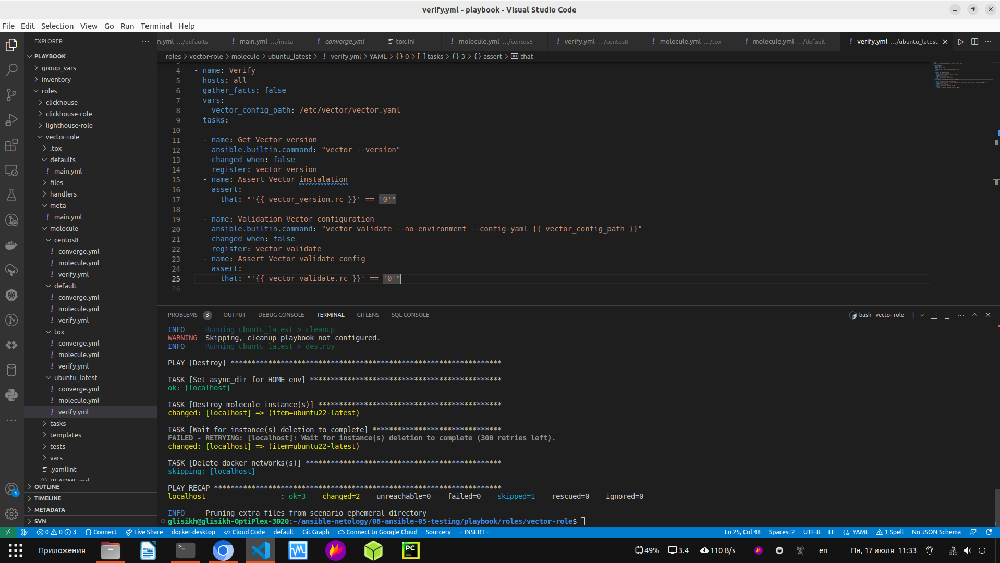
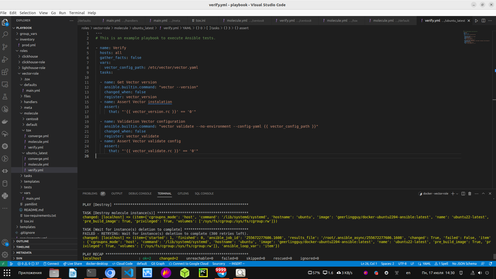
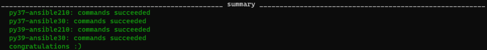

Домашнее задание к занятию 5 «Тестирование roles»

Подготовка к выполнению

1. Установите molecule: pip3 install "molecule==3.5.2" и драйвера pip3 install molecule_docker molecule_podman.

Всё установил.

Скриншот выполненного задания:

<p align="center">
  
</p>

2. Выполните docker pull aragast/netology:latest — это образ с podman, tox и несколькими пайтонами (3.7 и 3.9) внутри.

Выполнил и скачался образ Docker:

<p align="center">
  
</p>

Основная часть

Molecule

1. Запустите molecule test -s centos_7 внутри корневой директории clickhouse-role, посмотрите на вывод команды. 
Данная команда может отработать с ошибками, это нормально. Наша цель - посмотреть как другие в реальном мире используют молекулу.

Запустил и проверил вывод команды.

Скриншот выполненного задания:

<p align="center">
  
</p>

2. Перейдите в каталог с ролью vector-role и создайте сценарий тестирования по умолчанию при помощи molecule init scenario --driver-name docker.

Выполнил данную команду:

<p align="center">
  
</p>

3. Добавьте несколько разных дистрибутивов (centos:8, ubuntu:latest) для инстансов и протестируйте роль, исправьте найденные ошибки, если они есть.

Добавил несколько разных дистрибутивов (centos:8, ubuntu:latest):

<p align="center">
  
</p>

<p align="center">
  
</p>

4. Добавьте несколько assert в verify.yml-файл для проверки работоспособности vector-role (проверка, что конфиг валидный, проверка успешности запуска и др.).

Добавьте несколько assert в verify.yml-файл для проверки работоспособности vector-role:

<p align="center">
  
</p>

5. Запустите тестирование роли повторно и проверьте, что оно прошло успешно.

Запустил тестирование ubuntu_latest: molecule test -s ubuntu_latest

<p align="center">
  
</p>

6. Добавьте новый тег на коммит с рабочим сценарием в соответствии с семантическим версионированием.

[vector-role version 1.0.0](https://github.com/george25031996/vector-role/tree/main)


Tox

1. Добавьте в директорию с vector-role файлы из директории.

Добавил.

2. Запустите docker run --privileged=True -v <path_to_repo>:/opt/vector-role -w /opt/vector-role -it aragast/netology:latest /bin/bash, 
где path_to_repo — путь до корня репозитория с vector-role на вашей файловой системе.

```bash
glisikh@glisikh-OptiPlex-3020:~/ansible-netology/08-ansible-05-testing/playbook/roles/vector-role$ docker run --privileged=True -v ~/ansible-netology/08-ansible-05-testing/playbook/roles/vector-role:/opt/vector-role -w /opt/vector-role -it aragast/netology /bin/bash
[root@417a5fd90ab0 vector-role]# 

```

3. Внутри контейнера выполните команду tox, посмотрите на вывод.

Запустил внутри виртуальной машины: tox

<p align="center">
  
</p>

Получил успешный вывод:

<p align="center">
  
</p>

4. Создайте облегчённый сценарий для molecule с драйвером molecule_podman. Проверьте его на исполнимость.

Создал сценарий tox с драйвером molecule_podman.

5. Пропишите правильную команду в tox.ini, чтобы запускался облегчённый сценарий.

Прописал в tox.ini: 

```bash
commands =
    {posargs:molecule test -s tox --destroy always} 

```

Также в файле molecule.yml Прописал следующие команды для облегчённого сценария: 

```bash
scenario:
  test_sequence:
    - destroy
    - create
    - converge
    - idempotence
    - verify
    - destroy 

```

6. Запустите команду tox. Убедитесь, что всё отработало успешно.

Запустил в новой машине команду tox:

```bash
glisikh@glisikh-OptiPlex-3020:~/ansible-netology/08-ansible-05-testing/playbook/roles/vector-role$ docker run --privileged=True -v ~/ansible-netology/08-ansible-05-testing/playbook/roles/vector-role:/opt/vector-role -w /opt/vector-role -it aragast/netology /bin/bash
[root@2f55115e2a15 vector-role]# tox

```

7. Добавьте новый тег на коммит с рабочим сценарием в соответствии с семантическим версионированием.

[vector-role version 1.0.2]()
